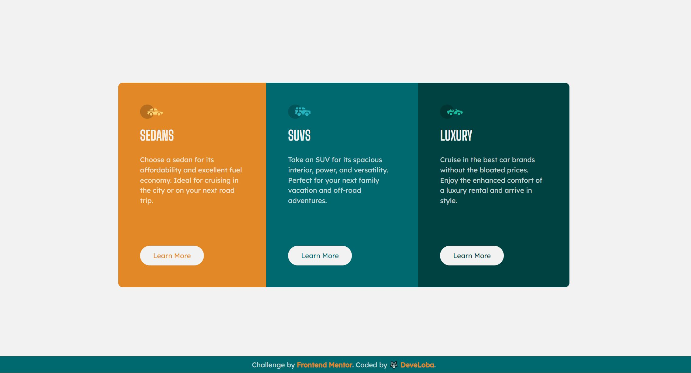

# Frontend Mentor - 3-column preview card component solution

This is a solution to the [3-column preview card component challenge on Frontend Mentor](https://www.frontendmentor.io/challenges/3column-preview-card-component-pH92eAR2-). Frontend Mentor challenges help you improve your coding skills by building realistic projects. 

## Table of contents

- [Frontend Mentor - 3-column preview card component solution](#frontend-mentor---3-column-preview-card-component-solution)
  - [Table of contents](#table-of-contents)
  - [Overview](#overview)
    - [The challenge](#the-challenge)
    - [Screenshot](#screenshot)
    - [Links](#links)
  - [My process](#my-process)
    - [Built with](#built-with)
    - [What I learned](#what-i-learned)
  - [Author](#author)

## Overview

### The challenge

Users should be able to:

- View the optimal layout depending on their device's screen size
- See hover states for interactive elements

### Screenshot

### Links

- Solution URL: [FrontendMentor solution](https://aesthetic-cupcake-559570.netlify.app/)
- Live Site URL: [Online page](https://www.frontendmentor.io/solutions/column-card-preview-html-and-css-using-pseudo-elements-nBx3BDEnXm)

## My process

### Built with

- Semantic HTML5 markup
- CSS custom properties
- Flexbox
- CSS Grid
- Mobile-first workflow

### What I learned

I did not have any main issues to code this challenge. I practiced the use of pseudo classes in this challenge.
For this, I used pseudo element ::before to add the icon of each card, and I used pseudo elements to select each card and apply separated styles.

However, I tried to keep clean CSS rules and repeat styles as little as possible. Please leave any comment to improve my code!

## Author

- Frontend Mentor - [@develoba](https://www.frontendmentor.io/profile/develoba)
- Twitter - [@develoba](https://www.twitter.com/develoba)

