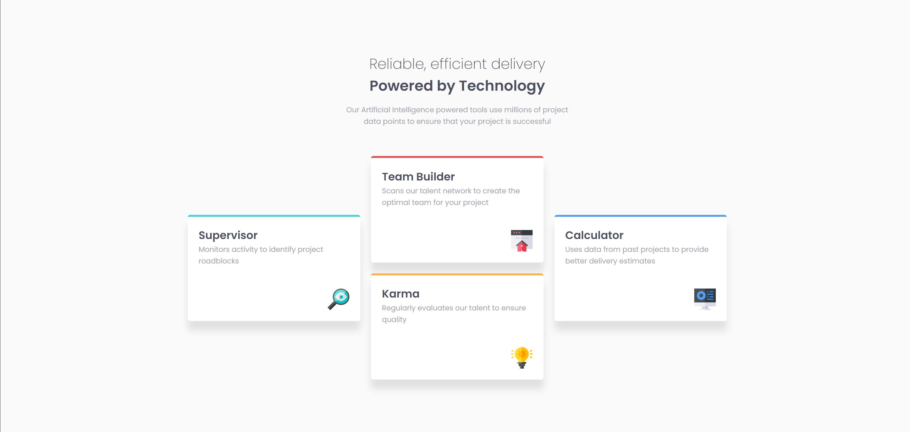

# Frontend Mentor - Four card feature section solution

This is a solution to the [Four card feature section challenge on Frontend Mentor](https://www.frontendmentor.io/challenges/four-card-feature-section-weK1eFYK). Frontend Mentor challenges help you improve your coding skills by building realistic projects. 

## Table of contents

- [Frontend Mentor - Four card feature section solution](#frontend-mentor---four-card-feature-section-solution)
  - [Table of contents](#table-of-contents)
  - [Overview](#overview)
    - [The challenge](#the-challenge)
    - [Screenshot](#screenshot)
    - [Links](#links)
  - [My process](#my-process)
    - [Built with](#built-with)
    - [What I learned](#what-i-learned)
  - [Author](#author)

## Overview

### The challenge

Users should be able to:

- View the optimal layout for the site depending on their device's screen size

### Screenshot

### Links

- Solution URL: [Frontend Mentor solution](https://www.frontendmentor.io/solutions/four-card-feature-using-html-and-css-pAsWTC9zVp)
- Live Site URL: [Online preview](https://superb-kulfi-bc009f.netlify.app/)

## My process

### Built with

- Semantic HTML5 markup
- CSS custom properties
- Flexbox
- CSS Grid
- Mobile-first workflow

### What I learned

For this project, I practiced my knowledge of BEM methodology, I tried to follow a clean CSS structure with section comments and used semantic HTML tags.

For the challenge, I firstly designed it for mobile flow, using flexbox for that; and then adjusted the design for desktop using CSS grid. I also tried for the first time using clamp() to adjust the width and make it more responsive.

Feel free to make any suggestions about this or any part of the code. Thanks and happy coding!

## Author

- Frontend Mentor - [@develoba](https://www.frontendmentor.io/profile/develoba)
- Twitter - [@develoba](https://www.twitter.com/develoba)