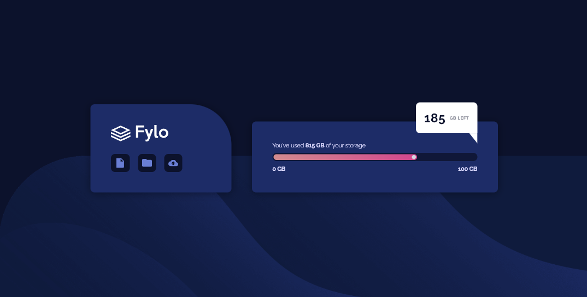

# Frontend Mentor - Fylo data storage component solution

This is a solution to the [Fylo data storage component challenge on Frontend Mentor](https://www.frontendmentor.io/challenges/fylo-data-storage-component-1dZPRbV5n). Frontend Mentor challenges help you improve your coding skills by building realistic projects. 

## Table of contents

- [Frontend Mentor - Fylo data storage component solution](#frontend-mentor---fylo-data-storage-component-solution)
  - [Table of contents](#table-of-contents)
  - [Overview](#overview)
    - [The challenge](#the-challenge)
    - [Screenshot](#screenshot)
    - [Links](#links)
  - [My process](#my-process)
    - [Built with](#built-with)
    - [What I learned](#what-i-learned)
  - [Author](#author)

**Note: Delete this note and update the table of contents based on what sections you keep.**

## Overview

### The challenge

Users should be able to:

- View the optimal layout for the site depending on their device's screen size

### Screenshot

### Links

- Solution URL: [FrontendMentor Solution](https://your-solution-url.com)
- Live Site URL: [Live on Netlify](https://your-live-site-url.com)

## My process

### Built with

- Semantic HTML5 markup
- Flexbox
- Absolute positioning

### What I learned

Very fun challenge! I used absolute positioning and ::after and ::before pseudoelements to make the progress bar. Can it be done in a better way and more responsive?

For the rest of the challenge, I simply used flexbox to align elements.

Feel free to comment about my code or any improvement that can be made!

## Author

- Frontend Mentor - [@develoba](https://www.frontendmentor.io/profile/develoba)
- Twitter - [@develoba](https://www.twitter.com/develoba)

