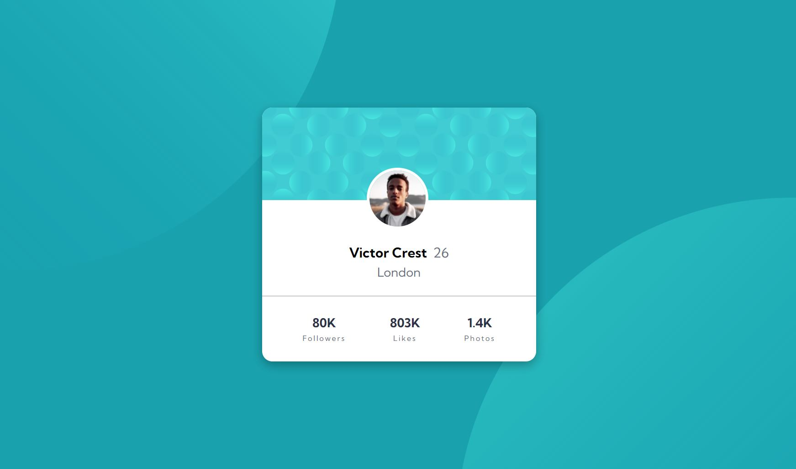

# Frontend Mentor - Profile card component solution

This is a solution to the [Profile card component challenge on Frontend Mentor](https://www.frontendmentor.io/challenges/profile-card-component-cfArpWshJ). Frontend Mentor challenges help you improve your coding skills by building realistic projects. 

## Table of contents

- [Frontend Mentor - Profile card component solution](#frontend-mentor---profile-card-component-solution)
  - [Table of contents](#table-of-contents)
  - [Overview](#overview)
    - [The challenge](#the-challenge)
    - [Screenshot](#screenshot)
    - [Links](#links)
  - [My process](#my-process)
    - [Built with](#built-with)
    - [What I learned](#what-i-learned)
  - [Author](#author)

## Overview

### The challenge

- Build out the project to the designs provided

### Screenshot




### Links

- Solution URL: [Frontend Mentor Solution](https://www.frontendmentor.io/solutions/profile-card-component-using-html-and-css-wk_6tdBqF8)
- Live Site URL: [Online Page](https://gleeful-salmiakki-b47822.netlify.app/)

## My process

### Built with

- Semantic HTML5 markup
- CSS custom properties
- Flexbox
- CSS Grid
- Mobile-first workflow

### What I learned

The main difficulty I found in this challenge is to apply the two background images. After thinking, reading some other developer's code and some documentation, I came out with the solution of adding two div containers for each image and add them with an absolute position. 

I would like to know if there is another possible solution for this.

The code I used to add these images is the following:

```html
<body>
  <div class="bg-img top-img"></div>
  <div class="bg-img bottom-img"></div>
  .
  .
  .
</body>
```
```css
.bg-img {
    width: 250px;
    height: 450px;
    position: absolute;
    z-index: -1;
}

.top-img {
    background: url('./images/bg-pattern-top.svg');
    background-position: 100% 100%;
    top: 0;
}
.bottom-img {
    background-image: url('./images/bg-pattern-bottom.svg');
    bottom: 0;
    right: 0;
}
```

## Author

- Frontend Mentor - [@develoba](https://www.frontendmentor.io/profile/develoba)
- Twitter - [@develoba](https://www.twitter.com/develoba)
