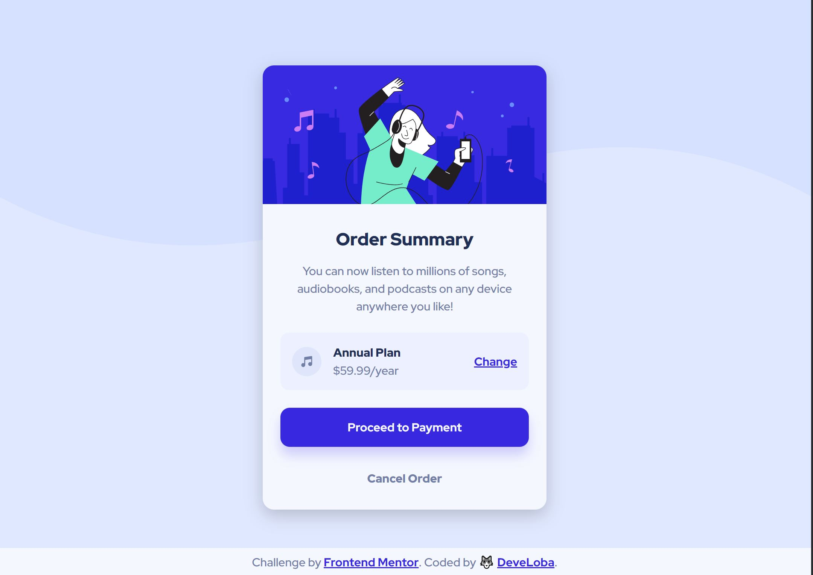

# Frontend Mentor - Order summary card solution

This is a solution to the [Order summary card challenge on Frontend Mentor](https://www.frontendmentor.io/challenges/order-summary-component-QlPmajDUj). Frontend Mentor challenges help you improve your coding skills by building realistic projects. 

## Table of contents

- [Frontend Mentor - Order summary card solution](#frontend-mentor---order-summary-card-solution)
  - [Table of contents](#table-of-contents)
  - [Overview](#overview)
    - [The challenge](#the-challenge)
    - [Screenshot](#screenshot)
    - [Links](#links)
  - [My process](#my-process)
    - [Built with](#built-with)
    - [What I learned](#what-i-learned)
  - [Author](#author)

## Overview

### The challenge

Users should be able to:

- See hover states for interactive elements

### Screenshot

### Links

- Solution URL: [Add solution URL here](https://your-solution-url.com)
- Live Site URL: [Add live site URL here](https://your-live-site-url.com)

## My process

### Built with

- Semantic HTML5 markup
- CSS custom properties
- Flexbox
- CSS Grid
- Mobile-first workflow

### What I learned

I didn't have a lot of difficulties for this project. However, I wanted to focus on writing clean code and HTML structure, while having good accessibility. 

For this to be achieved, I used semantic HTML tags like main, footer and article and tried not to use much div boxed. However, for the part of the plan price, I had to use several div to wrap the elements and apply flexbox to the image and text, and then to both the image+text and anchor tag.

I also tried to follow a BEM methodology.

For the CSS part, I focus on using rem units so that the design could be responsive. Is it better practice to use rem or em units?

Also, I am not sure about how is the best practice to make the card component bigger and responsive, just by adjusting its width using % or rem, or is it better to use another property?

I will keep on doing some challenges and keep learning. If you have any suggestions, I would really appreciate it.

## Author

- Frontend Mentor - [@develoba](https://www.frontendmentor.io/profile/develoba)
- Twitter - [@develoba](https://www.twitter.com/develoba)

