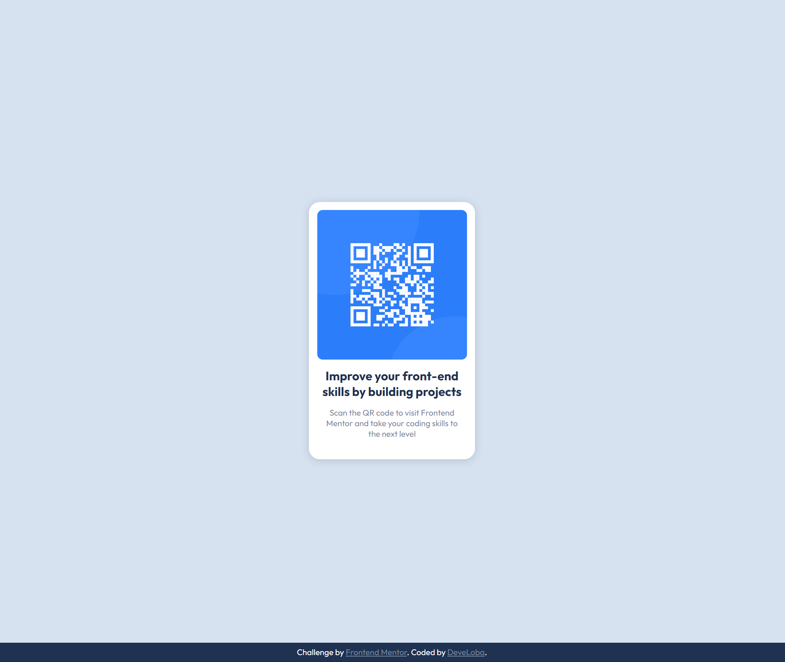

# Frontend Mentor - QR code component solution

This is a solution to the [QR code component challenge on Frontend Mentor](https://www.frontendmentor.io/challenges/qr-code-component-iux_sIO_H). Frontend Mentor challenges help you improve your coding skills by building realistic projects. 

## Table of contents

- [Frontend Mentor - QR code component solution](#frontend-mentor---qr-code-component-solution)
  - [Table of contents](#table-of-contents)
  - [Overview](#overview)
    - [Screenshot](#screenshot)
    - [Links](#links)
  - [My process](#my-process)
    - [Built with](#built-with)
    - [What I learned](#what-i-learned)
  - [Author](#author)

## Overview

### Screenshot 

### Links

- Solution URL: [Add solution URL here](https://your-solution-url.com)
- Live Site URL: [Add live site URL here](https://your-live-site-url.com)

## My process

### Built with

- Semantic HTML5 markup
- CSS custom properties
- CSS Grid
- Mobile-first workflow

### What I learned

This solution was developed for mobile size firstly (375px) and then adjusting the design for desktop view (1440px). In this case, the only adjustment for desktop view is that the card element cannot pass a certain width, so no need to add @media-queries.

I applied semantic HTML5 by adding all elements in a main tag. 
For the image section, I added a figure element, so that the section is optimized for web accesibility, adding also a figcaption for screen-readers. However, for the design, figcaption was hidden from the screen, although it is still available for screen-readers. 

On the other hand, I based HTML5 structure on BEM style, having a block (card) and element (card__img, card__title, etc.). In this design, there was no need of adding any modifiers.

For CSS styling, I tried to keep a clean structure, adding all variables needed and a reset part of the elements. I used grid for centering vertically the card element within the body, since I think it's an easier way than with flexbox. I could also use margin property for this, but it works better for centering elements horizontally. I actually used this property for centering horizontally the card element.

I hope you like my solution! Feel free to comment me with any thought, or if you think it could be improved!

Cheers and keep on coding!

## Author

- Frontend Mentor - [@develoba](https://www.frontendmentor.io/profile/develoba)
- Twitter - [@develoba](https://www.twitter.com/develoba)

